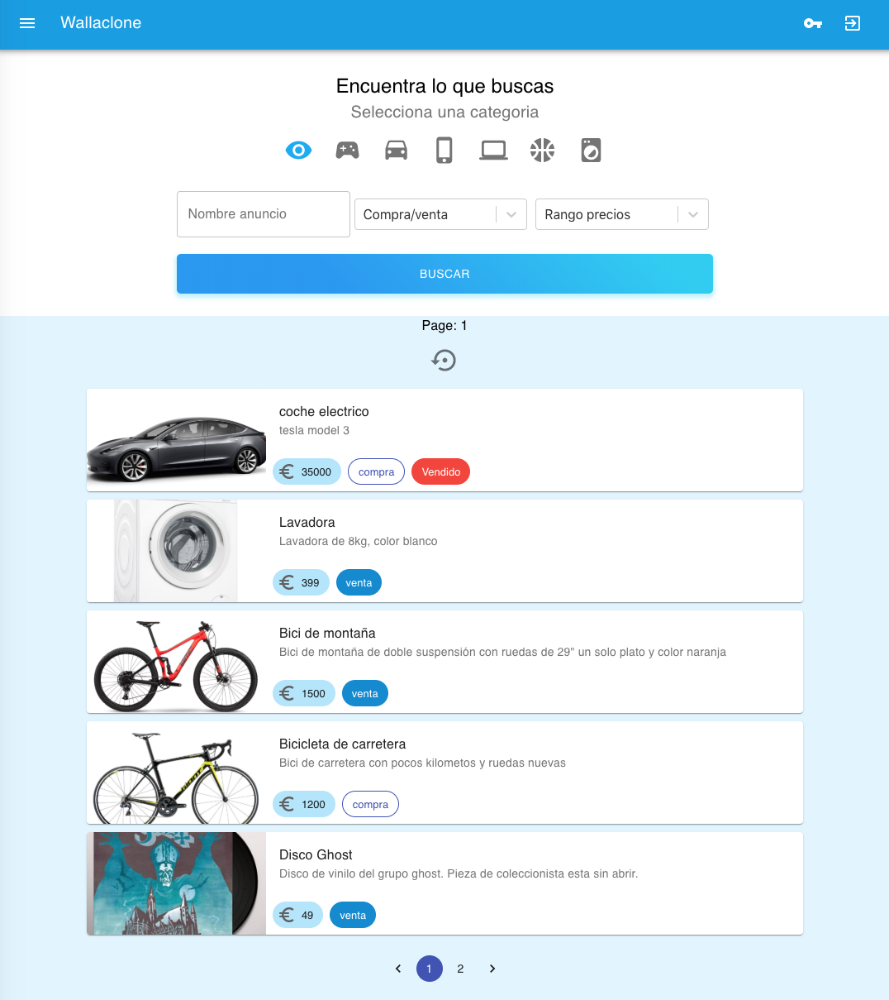

#README - Proyecto final bootcamp web 7 - WALLACLONE
Este es el proyecto final del bootcamp - Son dos partes, este repositorio que es la parte frontal
y el backend que se encuentra en la siguiente URL:
```
https://github.com/estecorral/backendPro
```

El proyecto se encuentra desplegado en aws en la siguiente url:
```
http://ec2-18-219-27-78.us-east-2.compute.amazonaws.com/
```

## Instalación
Para descargar este repositorio:

```
git clone https://github.com/estecorral/wallaclone.git
git clone https://github.com/estecorral/backendPro.git
```

*Se recomienda descargar en primer lugar el repositorio del backend.

### Instalación de modulos
npm install para instalar todas las dependencias de la aplicación
```
/proyectos/wallaclone/ npm install
```

## Ejecución
Para arrancar la aplicación react utilizaremos npm start (esta aplicación utiliza create-react-app):
```
/proyectos/wallaclone/ npm start
```

## Home
